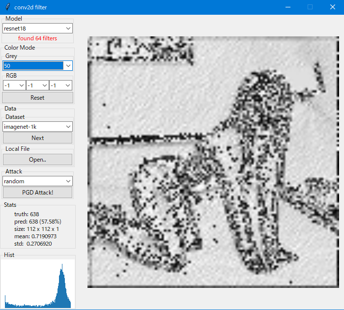
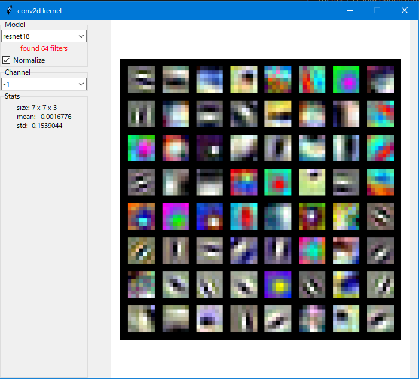
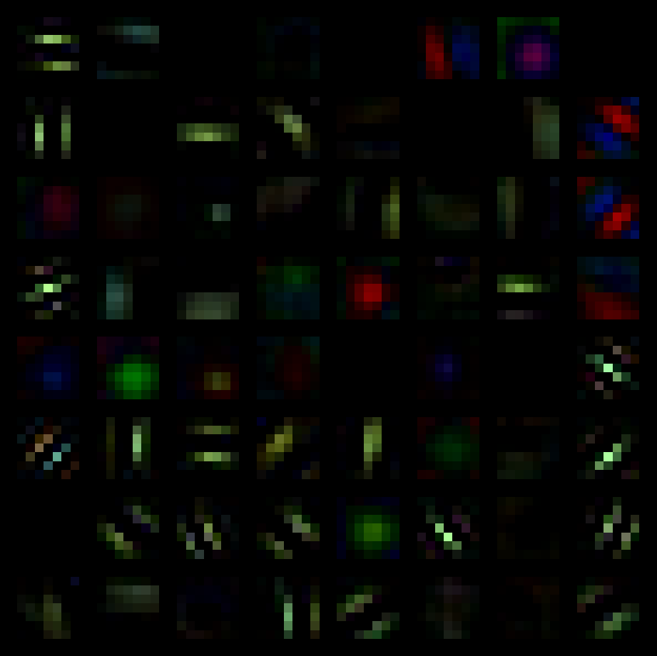
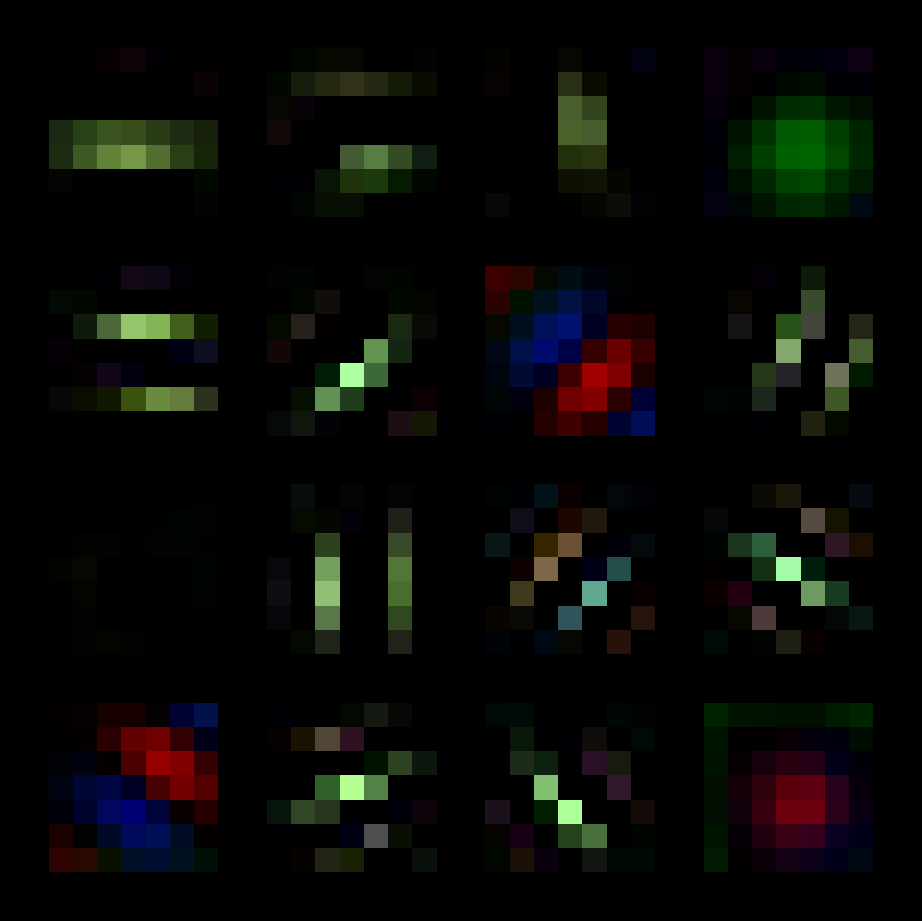
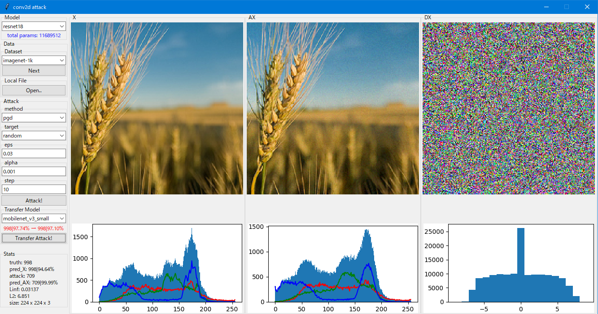

# conv2d-kernels

    Interactive experiments on pretrained Conv2d layer weights.

----

Conv2d layers are learnable 2D signal filters, it self is indeed a function-let, so what can it actually do? 🤔

### Apps

#### filter

⚪ inspect into featur maps: what does the **first** conv2d layer do in the well-known classifiers?

#### kernel

⚪ inspect into conv2d kernels: what are the learned geometrical basis?

The first Conv2d layer kernels of a pretrained model:

#### cluster

⚪ grouping kernels: many kernels seems to be similar thus redundant?

The first Conv2d layer kernels of a pretrained model (and centroids):

| kernels | kernel centroids |
| :-: | :-: |
|  |  |

#### attack

⚪ PGD adversarial attack: what if we attack a single conv2d layer?

#### fixedpoint

⚪ mathematical property of the well-known image kernels: what are the fixed points of a 2d kernel?

#### resources download

- The reprocessed ImageNet-1k dataset can be downloaded here: [https://pan.quark.cn/s/373b488d101e](https://pan.quark.cn/s/373b488d101e)
  - NOTE: It is a subset of 1k images from validation split of original intact ImageNet dataset
- Tiny-ImageNet can be found here: [tiny-imagenet-200](https://tiny-imagenet.herokuapp.com)

----

by Armit
2022/10/28 
